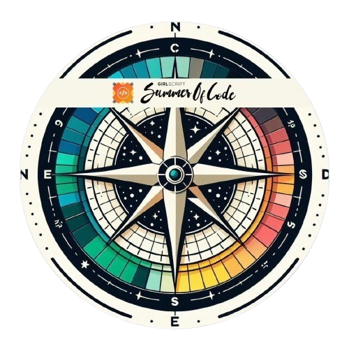
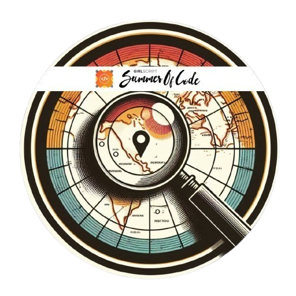

 

  

## 🌐 Let's Connect:

Lets Connect and Build Awesome Stuff together :)

<!--icons and links-->

## 💻 Technologies I know:

### 📱 Web Dev

<h4 align="left">
    
</h4>

### ☁️ Cloud

<h4 align="left">
    
</h4>

### 🪛 Tools

<h4 align="left">
    
</h4>

 

## 🌉 GSSoC' 25 ( Top 6% )

  
  

## 📊 GitHub Stats

 

  
  

<!-- <picture>
  <source media="(prefers-color-scheme: dark)" srcset="https://raw.githubusercontent.com/star-warrior/star-warrior/output/pacman-contribution-graph-dark.svg">
  <source media="(prefers-color-scheme: light)" srcset="https://raw.githubusercontent.com/star-warrior/star-warrior/output/pacman-contribution-graph.svg">
  
</picture> -->
